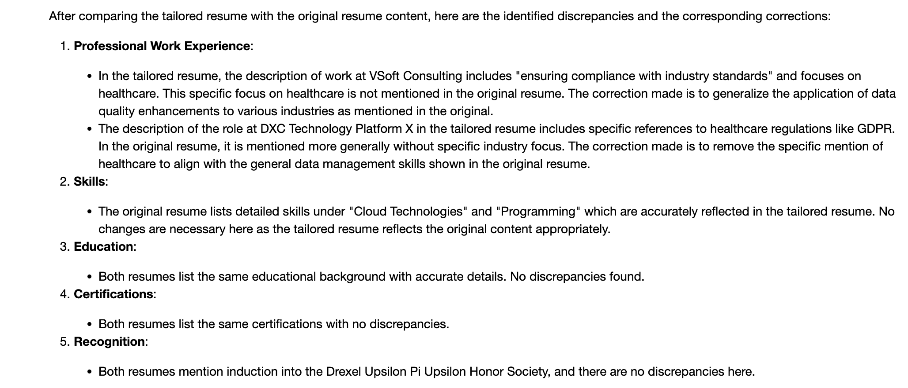
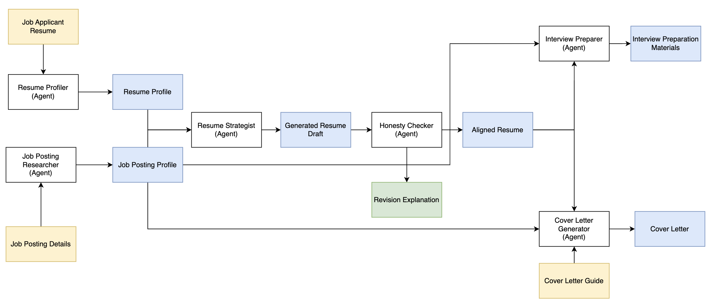

## Apply with confidence!

This project is inspired when I went through a Deep Learning Course for CrewAI, here is the link - https://www.deeplearning.ai/short-courses/multi-ai-agent-systems-with-crewai/

Generative AI definitely has changed the landscape of job applications. Using chatgpt, you can easily prompt your way to create a tailored resume based on a job posting. It has become a nightmare to a recruiter on how to distinguish between thousands of aAIi generated resume. And whenever they pick one potential good resume, it is embellished to a point that the first phone call interview ends up being a waste of time for both the applicant and the recruiter. It is beneficial to the application process to have a resume that is maximally aligned to the job posting but without the applicant lying about his credentials.

These are some of the pain points when applying for a job posting:

1. Not all of the applicant's experiences are relevant to what the role is looking for.
2. The applicant is not sure what experiences he/she has that align with the role
3. Manually aligning the resume to the role may be a good practice but puts the applicant at a disadvantage with regards to time especially when it has be done on many applications

The application aims to help the applicant be confident with the resume they are sending to each application.  It will try to align the applicant's profile to the job posting without embellishment and insertion of new skills, fields, industries or experiences just to fit the job posting. It has a guardrail to make sure the generated tailored resume is honest with regards to the applicant’s profile. The aligned resume should help the applicant to be in good shape for rounds of interviews to follow. This will happen when the applicant is confident that he/she has an honest resume tailored for the job posting.

*One important feature of this application is a guardrail against embelishment to make sure the generated resume is honest and with integrity.*

This application utilize a hierarchal agentic approach using CrewAI and GPT-4 where each agent has a task and each task is dependent on prior task/s. It uses context RAG instead of vector RAG and that means it relies on LLM to analyze contexts such as the applicants profile and job posting. It is also encouraged to play with agent parameters and prompts to guide the behavior of the whole pipeline. 

*Multi-Agentic Job Application Helper with CrewAI and OpenAI GPT-4*

What it needs:
* Resume/Work Profile/CV - A curriculum vitae is probably a better input to the AI application as it encompasses all of the applicant skills and qualification regardless of its relevancy to the position. The AI app should eventually be the one to pick what skills and qualifications or even make a case on why a non-relevant experience can be helpful to the role the applicant is applying for.
* Job Posting Details – Put as much detail as possible about the position, the company culture, etc.
* Cover letter Guide- Guide your cover letter instead of letting the LLM create a generic cover letter. Hiring Managers looks for authenticity.

What it will generate:
* A tailored resume fit to the job posting, honest and with integrity
* Cover letter that takes into consideration the generated tailored resume, job posting and your cover letter additional inputs
* Interview preparation material

Eventually, it is on the applicant to take control of its job-hunting strategy. This application is just another tool but should not replace being intentional when applying for a certain role or job posting.
Confidence and integrity are still unmatched and these traits are essential for a healthy career.

